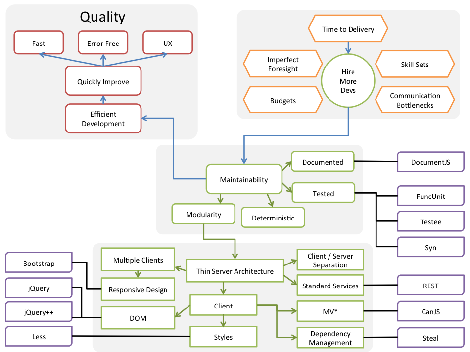

@page front-end/theory Theory
@parent front-end 0

@description Ideas on what matters with respect to technology.

@body
Before learning technology, it’s important to place it in the right
context. Technology on its own is rather meaningless.  Its when it provides
values to people does it become important. As you learn about technology,
it’s useful to draw a line from what users and businesses value (quality) to the techniques and tools used to web applications.

The following is a bit crazy, but it connects what users, businesses, and developers want (red) and the problems and constraints we face
(orange) with solutions
(green) and tools
(violet).

## The Goal

The goal is to create quality applications. The user, not the developer ultimately determines quality.
