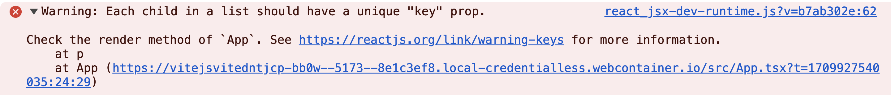

@page learn-react/intro-to-jsx Introduction to JSX
@parent learn-react 3
@outline 2

@description Learn how to use JSX to define your UI in React.

@body

## Overview

In this section, we will:

- Learn the basics of JSX
- Discover the differences between JSX and HTML
- Use JavaScript variables and expressions in JSX
- Work with conditionals and loops in JSX

## Objective 1: Create a UI with JSX

Now that we have our project set up, let’s update our page to look like the design below:


### What is JSX?

JSX is used by React developers to define the user interface.

JSX is a special syntax designed to look almost identical to HTML. Developers define the UI using JSX. React transforms that JSX into the HTML the browser displays. JSX can be written alongside standard JavaScript, which makes for a powerful programming environment.

#### Basic JSX looks like HTML

```tsx
const greeting = <h1>Hello, world!</h1>
```

This code snippet creates a simple JSX element: an `<h1>` header with the text “Hello, world!” This is similar to writing HTML, but it’s actually JSX inside a JavaScript file.

### Embedding a JavaScript expression in JSX

```tsx
const name = "Alice"
const greeting = <h1>Hello, {name}!</h1>
```

Here, we embed a JavaScript expression `{name}` within JSX. The value of the name variable is displayed within the `<h1>` tag.

### Combining JSX with standard JavaScript

```tsx
function welcome(name) {
  return <h1>Hello, {name}</h1>
}

const welcomeMessage = welcome("Alice")
```

This example illustrates a regular JavaScript function being called with a single argument. The `welcome` function returns JSX, showing how JSX can be seamlessly integrated within standard JavaScript functions.

### JSX transpiled

React has a procedural `React.createElement` syntax, but most applications do not use it directly. Instead, views are defined and maintained in JSX and will automatically be transpiled into the equivalent `React.createElement` calls at build-time.

```tsx
function welcome(name) {
  return React.createElement("h1", null, `Hello, ${name}!`)
}

const welcomeMessage = welcome("Alice")
```

This transformation is handled by tools like Vite during the build process, allowing us to write more readable and maintainable code using JSX.

### Differences between JSX and HTML

JSX looks a lot like HTML, and that’s intentional. Browsers understand HTML, JavaScript, and CSS. Eventually, anything we build has to be converted into one of those 3 syntaxes. Since our UI code will eventually end up as HTML, using JSX means it will be easier to understand and debug the end result in the browser.

However, JSX is converted into JavaScript and therefore is not an exact mirror of HTML. Some of the most noticeable differences include:

#### HTML has attributes, JSX has props

This nomenclature difference is because they are technically different, though they might appear to be the same visually.

When talking about the HTML below, you might say that the `href` attribute is a URL:

```html
<a href="https://www.bitovi.com/academy/"> Bitovi Academy </a>
```

The above is valid JSX too, but we would say that the `href` _prop_ is being passed into the anchor element.

#### Tags must close

In HTML, some elements are self-closing and don’t need a closing tag.

For example: the `img` element is a self-closing element:

```html

```

In JSX, no elements are self-closing, which means that _all_ elements must have a closing tag, like the `img` below:

```html

```

#### Writing comments

In HTML, comments are written using the `<!-- -->` syntax, seen below. Anything inside these comment tags is ignored by the browser and is not rendered or executed.

```html
<p>
  <!-- This is an HTML comment -->
  Visible content
</p>
```

In JSX, comments follow the JavaScript comment syntax. Since JSX is transpiled into JavaScript, you must use JavaScript’s {/\* \*/} syntax for comments within the JSX part of your code.

```tsx
const content = (
  <p>
    {/* This is a JSX comment */}
    Visible content
  </p>
)
```

#### Reserved words are renamed

The HTML attributes `class` and `for` are reserved words in JavaScript. In JSX, these are renamed to `className` and `htmlFor`, respectively.

```tsx
const content = (
  <p className="form-field">
    <label htmlFor="name-input">Name:</label>
    <input id="name-input" />
  </p>
)
```

#### Style prop

In HTML, the appearance of most elements can be altered using the `style` attribute. React supports a `style` prop, but it accepts an object, not a string. The style object has properties whose names are camel-case versions of their CSS counterparts. IE: "font-style" becomes `fontStyle`.

```tsx
const content = <p style={{ fontStyle: "italic" }}>Restaurants</p>
```

As we go through this training, you’ll learn additional differences.

#### Convention: Parenthesis

When dealing with JSX that needs multiple lines, the convention is to wrap it in parethesis. This helps keep your JSX clean and clear, rather than mixing it with the javascript around it.

```tsx
function Form() {
  return (
    <p className="form-field">
      <label htmlFor="name-input">Name:</label>
      <input id="name-input" />
    </p>
  )
}
```

#### Convention: Implicit Returns

When creating functions that have no logic and just return JSX, especially when they're an argument to a function, the convention is to use an arrow function with an implicit return. This is nearly always coupled with the parenthesis convention, too. (Don't worry: you'll learn about `.map` in the next objective.)

```tsx
const data = ["one", "two"]

function List() {
  return (
    <div>
      {data.map((name) => (
        <li key={name}>{name}</li>
      ))}
    </div>
  )
}
```

### Setup 1

We’ve created an assets package with images and styles you’ll need to build the application. Install the `place-my-order-assets` package.

✏️ Run:

```shell
npm install place-my-order-assets@0
```

✏️ Update **src/index.css** to be:

@diff ../../../exercises/react-vite/02-setting-up-your-environment/04-solution/src/index.css ../../../exercises/react-vite/03-intro-to-jsx/01-problem/src/index.css only

### Verify 1

✏️ Update **src/App.test.tsx** to be:

@diff ../../../exercises/react-vite/02-setting-up-your-environment/04-solution/src/App.test.tsx ../../../exercises/react-vite/03-intro-to-jsx/01-problem/src/App.test.tsx only

✏️ Run:

```shell
npm run test
```

Note that we won’t be able to write an automated test that verifies the styles and images appear as desired, so you will have to test those manually.

### Exercise 1

Take the below HTML and convert it to JSX in `app.tsx`:

@sourceref ./template.html

<strong>Having issues with your local setup?</strong> You can use either [StackBlitz](https://stackblitz.com/fork/github/bitovi/academy/tree/main/exercises/react-vite/03-intro-to-jsx/01-problem?file=src/App.tsx) or [CodeSandbox](https://codesandbox.io/p/devbox/github/bitovi/academy/tree/main/exercises/react-vite/03-intro-to-jsx/01-problem?file=src/App.tsx) to do this exercise in an online code editor.

### Solution 1

<details>
<summary>Click to see the solution</summary>

✏️ Update **src/App.tsx** to be:

@diff ../../../exercises/react-vite/03-intro-to-jsx/01-problem/src/App.tsx ../../../exercises/react-vite/03-intro-to-jsx/01-solution/src/App.tsx only

<strong>Having issues with your local setup?</strong> See the solution in [StackBlitz](https://stackblitz.com/fork/github/bitovi/academy/tree/main/exercises/react-vite/03-intro-to-jsx/01-solution?file=src/App.tsx) or [CodeSandbox](https://codesandbox.io/p/devbox/github/bitovi/academy/tree/main/exercises/react-vite/03-intro-to-jsx/01-solution?file=src/App.tsx).

</details>

## Objective 2: Expressions and loops in JSX

Next, we want to render a list of restaurants in our application:


To do so, we‘ll learn about:

- Using JavaScript variables and expressions in JSX
- Working with conditionals and loops in JSX

### Using JavaScript variables and expressions in JSX

JSX is dynamic. You can insert values from variables and objects into your JSX as we did with the image URL in the previous section.

```tsx
const name = "Bitovi"

const content = <p>Welcome to {name}!</p>
```

In the code above, use the `{name}` syntax to tell JSX that to render the value stored in the `name` variable (i.e. `"Bitovi"`) into our view.

You can take this a step further by interpolating multiple values, and using JavaScript functions to transform data on the fly. Anything that goes inside `{}` is executed as normal JavaScript. These are the same rules as the brackets on a prop: any JavaScript expression is valid inside the curly brackets.

```tsx
const person = {
  name: "mike",
  profession: "programmer",
}

const content = (
  <main>
    <h1>Hi I’m {person.name.toUpperCase()}!</h1>
    <p>I’m a {person.profession} living in Philadelphia.</p>
  </main>
)
```

@highlight 7,8

### JSX is a syntax extension for JavaScript

Remember, JSX is an alternative syntax for normal JavaScript—it is not magic. This means that you can use JSX as a normal value, too.

```tsx
const header = <h1>Hello World</h1>
const body = <p>My name is {"Mike"}</p>

function MyPage() {
  return (
    <main>
      {header}
      {body}
    </main>
  )
}
```

@codepen react

If rendered, `page` will output:

```html
<main>
  <h1>Hello World</h1>
  <p>My name is Mike</p>
</main>
```

If this surprises you, remember that underneath the syntactic sugar, JSX is nothing more than `React.createElement` calls:

```tsx
const header = React.createElement("h1", null, "Hello World")
const body = React.createElement("p", null, `My name is ${"Mike"}`)

const page = React.createElement("main", null, [header, body])
```

### Working with conditionals and loops in JSX

Only expressions which return a value may be interpolated. This includes static values, variables and calls to functions. It does not include control-flow statements such as `if`, `case`, `for`, `while`. These can either be abstracted behind a function, which is then called within the JSX or be re-written in a JSX-friendly way.

To put it simply: only things that you could pass into a function can be used inside the brackets.

#### Using conditionals

Conditions can be re-written using the ternary operator.

```tsx-error
// This does not work
const content = (
  <p>
    {
      if (a === b) { // Control flow does not belong in JSX
        "a and b are equal"
      } else {
        "a and b are different"
      }
    }
  </p>
)
```

```tsx
// But the same can be accomplished with ternaries
const content = (
  <p>
    {a === b // Ternaries are expressions.
      ? "a and b are equal"
      : "a and b are different"}
  </p>
)
```

If ternaries seem excessive for any particular case, you can write all your logic in a separate function and invoke it from within JSX.

```tsx
function makeResult() {
  return a === b ? "a and b are equal" : "a and b are different"
}

const content = <p>{makeResult()}</p>
```

#### Using loops

JSX does not support traditional loop statements like `for`, `while`, or `do...while` directly within JSX.

The example below will **not** work:

```tsx-error
const names = ['Alfa', 'Bravo', 'Charlie'];

// This does not work
const content = (
  <ul>
    {
      // Control flow does not belong in JSX
      for (let name of names) {
        <li>name</li>
      }
    }
  </ul>
)
```

The `Array.map()` function is the most common and idiomatic way to render lists in JSX.
It’s especially useful for rendering arrays of data as HTML elements.

```tsx
const names = ["Alfa", "Bravo", "Charlie"]

// This will work
const content = (
  <ul>
    {names.map((name) => {
      return <li key={name}>{name}</li>
    })}
  </ul>
)
```

That will produce the following HTML:

```html
<ul>
  <li>Alfa</li>
  <li>Bravo</li>
  <li>Charlie</li>
</ul>
```

There are lots of ways to iterate over arrays in JavaScript with functions like `Array.map`, `Array.filter`, and `Array.reduce`. These all work in JSX!

##### <span id="the-key-prop">The `key` prop</span>

Did you notice the `key` prop in the example above?

When rendering a list of elements, React needs a way to uniquely identify each element. This helps React understand which items have changed, been added, or removed, which is crucial for efficient re-rendering.

Each key should be a unique identifier among siblings. Keys should be stable (not change over time), predictable (generated in a predictable manner), and unique (no two elements in the list should have the same key).

It’s often convenient to use IDs from your data as keys. For example, if our data had `id` properties for each name, then we could use those as the `key` prop, even if there were duplicate names in the array:

```tsx
const names = [
  { id: "550e8400", name: "Alfa" },
  { id: "f47ac10b", name: "Bravo" },
  { id: "5a3c9dd9", name: "Alfa" },
  { id: "3d3f6f4d", name: "Charlie" },
  { id: "aab3fcba", name: "Delta" },
]

const content = (
  <ul>
    {names.map(({ id, name }) => {
      return <li key={id}>{name}</li>
    })}
  </ul>
)
```

That will produce the following HTML:

```html
<ul>
  <li>Alfa</li>
  <li>Bravo</li>
  <li>Alfa</li>
  <li>Charlie</li>
  <li>Delta</li>
</ul>
```

🔦 _During development, If you forget to provide a `key` prop for items in an array React will log the following error to the browser's console:_



### Setup 2

✏️ Update **src/App.tsx** to be:

@diff ../../../exercises/react-vite/03-intro-to-jsx/01-solution/src/App.tsx ../../../exercises/react-vite/03-intro-to-jsx/02-problem/src/App.tsx only

### Verify 2

Add these tests into your application to verify you have met the acceptance criteria. Note how React Testing Library allows our tests to specify exact elements.

✏️ Update **src/App.test.tsx** to be:

@diff ../../../exercises/react-vite/03-intro-to-jsx/01-solution/src/App.test.tsx ../../../exercises/react-vite/03-intro-to-jsx/02-solution/src/App.test.tsx only

<strong>Having issues with your local setup?</strong> You can use either [StackBlitz](https://stackblitz.com/fork/github/bitovi/academy/tree/main/exercises/react-vite/03-intro-to-jsx/02-problem?file=src/App.tsx) or [CodeSandbox](https://codesandbox.io/p/devbox/github/bitovi/academy/tree/main/exercises/react-vite/03-intro-to-jsx/02-problem?file=src/App.tsx) to do this exercise in an online code editor.

### Exercise 2

- Update the existing JSX to render the list of restaurants
- Use `Array.map()` to iterate over the `restaurants.data`
- Make sure to use `key` inside the `.map()`
- Render `<p>No restaurants.</p>` if, hypothetically, there weren’t any restaurants.

### Solution 2

<details>
<summary>Click to see the solution</summary>

✏️ Update **src/App.tsx**

@diff ../../../exercises/react-vite/03-intro-to-jsx/02-problem/src/App.tsx ../../../exercises/react-vite/03-intro-to-jsx/02-solution/src/App.tsx only

<strong>Having issues with your local setup?</strong> See the solution in [StackBlitz](https://stackblitz.com/fork/github/bitovi/academy/tree/main/exercises/react-vite/03-intro-to-jsx/02-solution?file=src/App.tsx) or [CodeSandbox](https://codesandbox.io/p/devbox/github/bitovi/academy/tree/main/exercises/react-vite/03-intro-to-jsx/02-solution?file=src/App.tsx).

</details>

## Next steps

Next we will learn about building out a React application with components.
