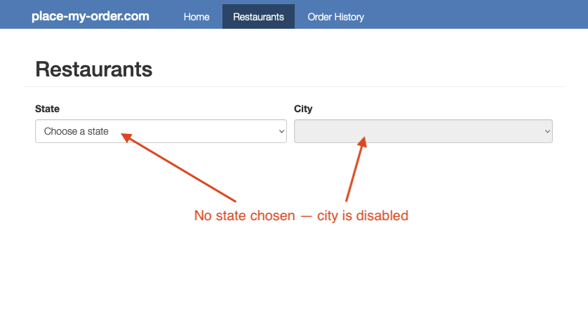

@page learn-react/stateful-hooks Managing State in React
@parent learn-react 8
@outline 3

@description Work with React's useState Hook to manage a component's state.

@body

## Overview

In this section, we will:

- Cover the fundamentals of React Hooks.

## Objective 1: Introducing React Hooks and useId

### Overview of state

State in React is a crucial concept, as it represents the parts of an app
that can change over time. Each component can have its own state, allowing
them to maintain and manage their own data independently. When the state
changes, React re-renders the component and updates the DOM if it needs to.

There are different types of state within an application:

- **Local State:** This is data we manage in one or another component. Local state is often managed in React using the `useState` Hook, which we will cover in Objective 2 below.
- **URL State:** The state that exists on our URLs, including pathname and query parameters. We already covered this in our section about Routing!
- **Global State:** This refers to data that is shared between multiple components. In React, global state can be managed using Context API or state management libraries; this is out of scope for this training.

### React Hooks

We’ve mentioned before that `useState` is a Hook for managing state, but what
does that mean?

React Hooks (referred to as just Hooks for the rest of this training) are
special functions that allow us to “hook” into React functionality.
Hooks provide us with many conveniences like sharing stateful logic
between components and simplifying what would be otherwise complex components.

We’ve actually already seen and used a Hook while building Place My Order!
Do you remember this code from earlier?

@sourceref ../../../exercises/react-vite/06-routing/02-solution/src/App.tsx
@highlight 1, 5-6, only

The `useMatch` Hook from `react-router-dom` allowed us to check whether a given
path “matched” the current route.

React imposes several rules around the use of Hooks:

- **First,** only call Hooks from functional React components or your own custom Hook.

- **Second,** all the Hooks in a React function must be invoked in the
same order every time the function runs, so no Hooks can occur after an `if`,
`loop`, or `return` statement. Typically this means all Hooks are placed at the
top of the React function body.

- **Third,** Hooks should be named by prefixing their functionality with `use`
(e.g. `useMatch`).

Hooks can only be used in functional components. Almost anything that could be
done in a class component can be done with Hooks. _The one thing that class
component can do that Hooks cannot is implement error boundaries._

### Setup 1

✏️ Update **src/pages/RestaurantList/RestaurantList.tsx** to include the State
and City dropdown lists.

@diff ../../../exercises/react-vite/07-styling-in-react/01-solution/src/pages/RestaurantList/RestaurantList.tsx ../../../exercises/react-vite/08-stateful-hooks/01-problem/src/pages/RestaurantList/RestaurantList.tsx only

### Verify 1

These tests will pass when the solution has been implemented properly.

✏️ Update **src/pages/RestaurantList/RestaurantList.test.tsx**:

@diff ../../../exercises/react-vite/07-styling-in-react/01-solution/src/pages/RestaurantList/RestaurantList.test.tsx ../../../exercises/react-vite/08-stateful-hooks/01-problem/src/pages/RestaurantList/RestaurantList.test.tsx only

### Exercise 1

- Associate the `<label>` and `<select>` elements together using ID values provided by the `useId` Hook.

<strong>Having issues with your local setup?</strong> You can use either
[StackBlitz](https://stackblitz.com/fork/github/bitovi/academy/tree/main/exercises/react-vite/08-stateful-hooks/01-problem?file=src%2Fpages%2FRestaurantList%2FRestaurantList.tsx)
or
[CodeSandbox](https://codesandbox.io/p/devbox/github/bitovi/academy/tree/main/exercises/react-vite/08-stateful-hooks/01-problem?file=src%2Fpages%2FRestaurantList%2FRestaurantList.tsx)
to do this exercise in an online code editor.

### Solution 1

Click to see the solution

✏️ Update **src/pages/RestaurantList/RestaurantList.tsx** to be:

@diff ../../../exercises/react-vite/08-stateful-hooks/01-problem/src/pages/RestaurantList/RestaurantList.tsx ../../../exercises/react-vite/08-stateful-hooks/01-solution/src/pages/RestaurantList/RestaurantList.tsx only

## Objective 2: Manage component state using Hooks

When users make choices that need to be maintained or that affect other parts of
the UI, we need to use `state`. That's a pretty abstract concept so let's look
at a concrete example from the Place My Order Restaurants tab.

There are two dropdown lists — "State" which has a list of U.S. states, and
another named "City" that displays a list of cities located in the selected
"State" item. Until the user makes a choice in the "State" dropdown, the "City"
dropdown has no additional options.

If “Illinois” is chosen in the “State” dropdown that value needs to persist
through component rendering and be available for use throughout the code:
getting the cities for Illinois, and enabling the “City” dropdown list. To
accomplish that the value “Illinois” is stored in React `state`.

### useState

We can store state that persists through component rendering with the `useState`
hook. You can set the initial state value when the component **first** renders
by providing the value as an argument to the Hook. _If you do not provide a
value the initial state value will be `undefined`._

This example shows a `useState` Hook being set with an initial value of an empty
string.

@sourceref ./useState.tsx
@highlight 1, 4, only

As you can see in the previous example, `useState` returns an array with two
elements: the first is the current state value of the Hook, and the second is a
setter function that is used to update the state value. In the following code,
the value and setter are being used to update changes in a select component.

@sourceref ./useState.tsx
@highlight 13, only

Every time a `useState`'s setter is invoked with a new value, React compares the
new value with the current value. If the values are the same, nothing happens;
**if the values are different, React will rerender the component** so the new
state value can be used to update the component. In the example above, when the
user makes a selection, the `List` component is rendered again, and the select
is updated with the current value.

### ChangeEvent

`ChangeEvent` is a type provided by React’s TypeScript definitions. It’s used to
type the `event` object that you receive when an event occurs, like a change in
a form field. In TypeScript, when you're working with event handlers in React,
you often need to specify the type of the event object to get the full benefits
of TypeScript’s type checking.

The `<HTMLInputElement>` part of `ChangeEvent<HTMLInputElement>` specifies that
this change event is specifically for an HTML `<input>` element. In HTML and the
DOM, different elements have different properties. By specifying `<HTMLInputElement>`,
TypeScript knows that this event is for an `<input>` element, and it will expect and
allow properties specific to an `<input>` element, like `value`, `checked`, etc.

### event.target.value

When an event occurs, such as a user typing in an input field, an `event` object is
passed to the event handler function. This event object contains various properties
and methods that provide information about the event.

One such property is `target`, which is a reference to the DOM element that triggered
the event. In the case of an input field, target would refer to the specific `<input>`
element where the user is typing.

The property `event.target.value` is particularly important when dealing with input
fields. The value property here holds the current content of the input field. It
represents what the user has entered or selected. When you access `event.target.value`
in your event handler function, you’re essentially retrieving the latest input
provided by the user. This is commonly used to update the state of the component with
the new input value, ensuring that the component’s state is in sync with what the user
is entering. In a TypeScript context, this process not only manages the state
dynamically but also ensures type safety, making your code more robust and less prone
to errors.

### Setup 2

✏️ Update **src/pages/RestaurantList/RestaurantList.tsx** to be the following:

@diff ../../../exercises/react-vite/08-stateful-hooks/01-solution/src/pages/RestaurantList/RestaurantList.tsx ../../../exercises/react-vite/08-stateful-hooks/02-problem/src/pages/RestaurantList/RestaurantList.tsx only

### Verify 2

These tests will pass when the solution has been implemented properly.

✏️ Update **src/pages/RestaurantList/RestaurantList.test.tsx** to be the
following:

@diff ../../../exercises/react-vite/08-stateful-hooks/01-solution/src/pages/RestaurantList/RestaurantList.test.tsx ../../../exercises/react-vite/08-stateful-hooks/02-solution/src/pages/RestaurantList/RestaurantList.test.tsx only

### Exercise 2

- The selected **state** value should be managed by a `useState` Hook.
- The selected **city** value should be managed by a `useState` Hook.
- The City select should only include cities for the selected state.

<strong>Having issues with your local setup?</strong> You can use either
[StackBlitz](https://stackblitz.com/fork/github/bitovi/academy/tree/main/exercises/react-vite/08-stateful-hooks/01-solution?file=src%2Fpages%2FRestaurantList%2FRestaurantList.tsx)
or
[CodeSandbox](https://codesandbox.io/p/devbox/github/bitovi/academy/tree/main/exercises/react-vite/08-stateful-hooks/01-solution?file=src%2Fpages%2FRestaurantList%2FRestaurantList.tsx)
to do this exercise in an online code editor.

### Solution 2

Click to see the solution

✏️ Update **src/pages/RestaurantList/RestaurantList.tsx** to be:

@diff ../../../exercises/react-vite/08-stateful-hooks/02-problem/src/pages/RestaurantList/RestaurantList.tsx ../../../exercises/react-vite/08-stateful-hooks/02-solution/src/pages/RestaurantList/RestaurantList.tsx only

## Objective 3

TODO

### Concept 1

TODO

### Concept 2

TODO

### Setup 3

✏️ Update **src/pages/RestaurantList/RestaurantList.tsx** to be:

@diff ../../../exercises/react-vite/08-stateful-hooks/02-solution/src/pages/RestaurantList/RestaurantList.tsx ../../../exercises/react-vite/08-stateful-hooks/03-problem/src/pages/RestaurantList/RestaurantList.tsx only

✏️ Create **src/services/restaurant/hooks.ts** and update it to be:

@sourceref ../../../exercises/react-vite/08-stateful-hooks/03-problem/src/services/restaurant/hooks.ts

✏️ Create **src/services/restaurant/interfaces.ts** and update it to be:

@sourceref ../../../exercises/react-vite/09-making-http-requests/01-solution/src/services/restaurant/interfaces.ts

### Verify 3

✏️ Create **src/services/restaurant/hooks.test.ts** and update it to be:

@sourceref ../../../exercises/react-vite/08-stateful-hooks/03-solution/src/services/restaurant/hooks.test.ts

### Exercise 3

TODO

### Solution 3

Click to see the solution

✏️ Update **src/pages/RestaurantList/RestaurantList.tsx** to be:

@diff ../../../exercises/react-vite/08-stateful-hooks/03-problem/src/pages/RestaurantList/RestaurantList.tsx ../../../exercises/react-vite/08-stateful-hooks/03-solution/src/pages/RestaurantList/RestaurantList.tsx only

✏️ Update **src/services/restaurant/hooks.ts** to be:

@diff ../../../exercises/react-vite/08-stateful-hooks/03-problem/src/services/restaurant/hooks.ts ../../../exercises/react-vite/08-stateful-hooks/03-solution/src/services/restaurant/hooks.ts only

## Next steps

TODO