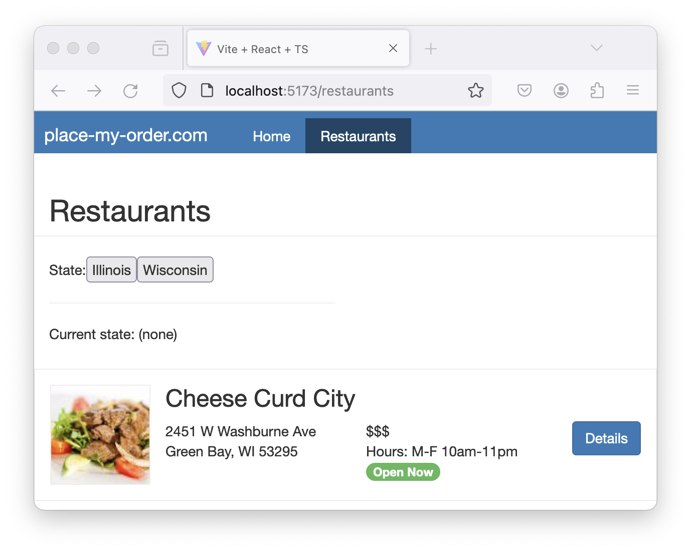
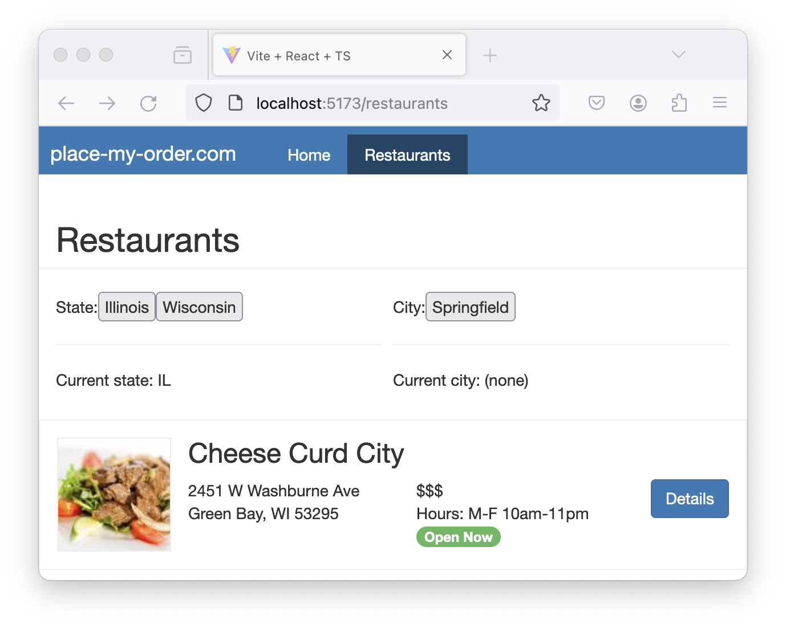

@page learn-react/stateful-hooks Managing State in React
@parent learn-react 8
@outline 2

@description Work with React’s useState Hook to manage a component’s state.

@body

## Overview

In this section, we will:

- Get an overview of state management
- Cover the fundamentals of React Hooks
- Review the Rules of Hooks
- Learn about the `useState` Hook
- Create custom Hooks as services

## Objective 1: Add buttons to select a state

Currently, our restaurant list is a static array of restaurants. We want to work towards
having a `<select>` dropdown for choosing a _state_, then a _city_ in that state, then
loading the list of restaurants for that city.

To start, let’s focus on rendering buttons for each state that we can select. Then, when
the button for a state is activated, we want to keep track of which state was chosen.

### Overview of state management

State in React is a crucial concept, as it represents the parts of an app
that can change over time. Each component can have its own state, allowing
them to maintain and manage their own data independently. When the state
changes, React re-renders the component and updates the DOM if it needs to.

There are different types of state within an application:

- **Local State:** This is data we manage in one or another component. Local state is often managed in React using the `useState` Hook, which we will cover in Objective 2 below.
- **URL State:** The state that exists on our URLs, including pathname and query parameters. We already covered this in our section about Routing!
- **Global State:** This refers to data that is shared between multiple components. In React, global state can be managed using Context API or state management libraries; this is out of scope for this training.

### Intro to React Hooks

We’ve mentioned before that `useState` is a Hook for managing state, but what
does that mean?

React Hooks (referred to as just Hooks for the rest of this training) are
special functions that allow us to “hook” into React functionality.
Hooks provide us with many conveniences like sharing stateful logic
between components and simplifying what would be otherwise complex components.

We’ve actually already seen and used a Hook while building Place My Order!
Do you remember this code from earlier?

@sourceref ../../../exercises/react-vite/06-routing/02-solution/src/App.tsx
@highlight 1, 5-6, only

The `useMatch` Hook from `react-router-dom` allowed us to check whether a given
path “matched” the current route.

### The Rules of Hooks

React imposes several rules around the use of Hooks:

- **First,** only call Hooks from functional React components or your own custom Hook.

- **Second,** all the Hooks in a React function must be invoked in the
same order every time the function runs, so no Hooks can occur after an `if`,
`loop`, or `return` statement. Typically this means all Hooks are placed at the
top of the React function body.

- **Third,** Hooks should be named by prefixing their functionality with `use`
(e.g. `useMatch`).

Hooks can only be used in functional components. Almost anything that could be
done in a class component can be done with Hooks.

### The useState Hook

We can store state that persists through component rendering with the `useState`
hook. You can set the initial state value when the component **first** renders
by providing the value as an argument to the Hook. _If you do not provide a
value the initial state value will be `undefined`._

This example shows a `useState` Hook being set with an initial value of `"Auto"`:

@sourceref ./useState.tsx
@highlight 1, 4, only

As you can see in the previous example, `useState` returns an array with two
elements: the first is the current state value of the Hook, and the second is a
setter function that is used to update the state value.

In the following code, the value is being rendered and the setter is being used
to keep track of which theme is chosen:

@sourceref ./useState.tsx
@highlight 8, 14, 16, 19, 22, only

Every time a `useState`’s setter is invoked with a new value, React compares the
new value with the current value. If the values are the same, nothing happens;
**if the values are different, React will rerender the component** so the new
state value can be used to update the component.

In the example above, when the user makes a selection, the `Settings` component
is rendered again, and the paragraph is updated with the current value.

### Setup 1

✏️ Update **src/pages/RestaurantList/RestaurantList.tsx** to include the State
and City dropdown lists.

@diff ../../../exercises/react-vite/07-styling-in-react/01-solution/src/pages/RestaurantList/RestaurantList.tsx ../../../exercises/react-vite/08-stateful-hooks/01-problem/src/pages/RestaurantList/RestaurantList.tsx only

### Verify 1

These tests will pass when the solution has been implemented properly.

✏️ Update **src/pages/RestaurantList/RestaurantList.test.tsx**:

@diff ../../../exercises/react-vite/07-styling-in-react/01-solution/src/pages/RestaurantList/RestaurantList.test.tsx ../../../exercises/react-vite/08-stateful-hooks/01-problem/src/pages/RestaurantList/RestaurantList.test.tsx only

### Exercise 1

Let’s create buttons for each state that we can select. Then, when the button
for a state is activated, we want to keep track of which state was choosen.

- Call `useState()` to get a `state` variable and `setState` setter.
- Create a helper function that takes a `short` state name and calls `setState`.
- Add an `onClick` handler to the `button` that calls your helper function.
- Update the paragraph to show the currently-selected state.

<strong>Having issues with your local setup?</strong> You can use either [StackBlitz](https://stackblitz.com/fork/github/bitovi/academy/tree/main/exercises/react-vite/08-stateful-hooks/01-problem?file=src/pages/RestaurantList/RestaurantList.tsx) or [CodeSandbox](https://codesandbox.io/p/devbox/github/bitovi/academy/tree/main/exercises/react-vite/08-stateful-hooks/01-problem?file=src/pages/RestaurantList/RestaurantList.tsx) to do this exercise in an online code editor.

### Solution 1

Click to see the solution

✏️ Update **src/pages/RestaurantList/RestaurantList.tsx** to be:

@diff ../../../exercises/react-vite/08-stateful-hooks/01-problem/src/pages/RestaurantList/RestaurantList.tsx ../../../exercises/react-vite/08-stateful-hooks/01-solution/src/pages/RestaurantList/RestaurantList.tsx only

<strong>Having issues with your local setup?</strong> See the solution in [StackBlitz](https://stackblitz.com/fork/github/bitovi/academy/tree/main/exercises/react-vite/08-stateful-hooks/01-solution?file=src/pages/RestaurantList/RestaurantList.tsx) or [CodeSandbox](https://codesandbox.io/p/devbox/github/bitovi/academy/tree/main/exercises/react-vite/08-stateful-hooks/01-solution?file=src/pages/RestaurantList/RestaurantList.tsx).

## Objective 2: Add buttons to select a city

Now that we have buttons for selecting the state, let’s add buttons for selecting the city:

After selecting both the state and city, we will see those values reflected in our UI:

### Setup 2

✏️ Update **src/pages/RestaurantList/RestaurantList.tsx** to be the following:

@diff ../../../exercises/react-vite/08-stateful-hooks/01-solution/src/pages/RestaurantList/RestaurantList.tsx ../../../exercises/react-vite/08-stateful-hooks/02-problem/src/pages/RestaurantList/RestaurantList.tsx only

### Verify 2

These tests will pass when the solution has been implemented properly.

✏️ Update **src/pages/RestaurantList/RestaurantList.test.tsx** to be the
following:

@diff ../../../exercises/react-vite/08-stateful-hooks/01-solution/src/pages/RestaurantList/RestaurantList.test.tsx ../../../exercises/react-vite/08-stateful-hooks/02-solution/src/pages/RestaurantList/RestaurantList.test.tsx only

### Exercise 2

Similar to our state buttons, let’s create buttons for selecting a city.

- Call `useState()` to get a `city` variable and `setCity` setter.
- Filter the `cities` list based on which state is selected.
- Create a helper function that takes a `cityName` and calls `setCity`.
- Add an `onClick` handler to the `button` that calls your helper function.
- Update the paragraph to show the currently-selected city.

Hint: Use [`Array.filter()`](https://developer.mozilla.org/en-US/docs/Web/JavaScript/Reference/Global_Objects/Array/filter)
to narrow down the list of cities based on which state is selected.

<strong>Having issues with your local setup?</strong> You can use either [StackBlitz](https://stackblitz.com/fork/github/bitovi/academy/tree/main/exercises/react-vite/08-stateful-hooks/02-problem?file=src/pages/RestaurantList/RestaurantList.tsx) or [CodeSandbox](https://codesandbox.io/p/devbox/github/bitovi/academy/tree/main/exercises/react-vite/08-stateful-hooks/02-problem?file=src/pages/RestaurantList/RestaurantList.tsx) to do this exercise in an online code editor.

### Solution 2

Click to see the solution

✏️ Update **src/pages/RestaurantList/RestaurantList.tsx** to be:

@diff ../../../exercises/react-vite/08-stateful-hooks/02-problem/src/pages/RestaurantList/RestaurantList.tsx ../../../exercises/react-vite/08-stateful-hooks/02-solution/src/pages/RestaurantList/RestaurantList.tsx only

<strong>Having issues with your local setup?</strong> See the solution in [StackBlitz](https://stackblitz.com/fork/github/bitovi/academy/tree/main/exercises/react-vite/08-stateful-hooks/02-solution?file=src/pages/RestaurantList/RestaurantList.tsx) or [CodeSandbox](https://codesandbox.io/p/devbox/github/bitovi/academy/tree/main/exercises/react-vite/08-stateful-hooks/02-solution?file=src/pages/RestaurantList/RestaurantList.tsx).

## Objective 3: Refactor cities into a custom Hook

Our `RestaurantList.tsx` file has started to get long again. Let’s refactor the cities code
into its own custom Hook so our code is more maintainable.

### What are custom Hooks?

React’s Hooks API provides a powerful and flexible way to encapsulate and reuse functionality
across our components. While React comes with a set of built-in Hooks, we can also create our
own custom Hooks. This allows us to abstract component logic into reusable functions. Custom
Hooks are particularly useful when we find ourselves repeating the same logic in multiple
components.

Custom Hooks are JavaScript functions that can use other React Hooks and provide a way to share
logic across multiple components. Like built-in Hooks, custom Hooks must adhere to React’s rules
of Hooks. The naming convention for custom Hooks is to start with `use`, like `useCustomHook`.

### Why use custom Hooks?

Putting stateful logic into a custom Hook has numerous benefits:

**Reusability:** One of the primary reasons for creating custom Hooks is reusability.
You might find yourself repeating the same logic in different components—for
example, fetching data from an API, handling form input, or managing a subscription.
By refactoring this logic into a custom Hook, you can easily reuse this functionality
across multiple components, keeping your code DRY (Don’t Repeat Yourself).

**Separation of concerns:** Custom Hooks allow you to separate complex logic from the
component logic. This makes your main component code cleaner and more focused on
rendering UI, while the custom Hook handles the business logic or side effects.
It aligns well with the principle of single responsibility, where a function or
module should ideally do one thing only.

**Easier testing and maintenance:** Isolating logic into custom Hooks can make your code
easier to test and maintain. Since Hooks are just JavaScript functions, they can be
tested independently of any component. This isolation can lead to more robust and
reliable code.

**Simplifying components:** If your component is becoming too large and difficult to
understand, moving some logic to a custom Hook can simplify it. This not only
improves readability but also makes it easier for other developers to grasp what
the component is doing.

**Sharing stateful logic:** Custom Hooks can contain stateful logic, which is not
possible with regular JavaScript functions. This means you can have a Hook that
manages its own state and shares this logic across multiple components, something
that would be difficult or impossible with traditional class-based components.

### How to create a custom Hook

To create a custom Hook, you start by defining a function that starts with `use`.
This Hook can call other Hooks and return whatever value is necessary.

Let’s create a Hook that keeps track of a boolean state, and also provides a function
for toggling that state:

@sourceref ./useToggle.tsx

In the example above, you can see that our `useToggle` Hook is a function that has an internal
`useState` to keep track of the toggle’s on/off status. This hook has a `handleToggle` function
for changing its internal state. Lastly, we can see that the `useToggle` Hook returns an array
with the `on` status and the `handleToggle` function.

#### How to use a custom Hook

How would we use this Hook? Let’s take a look at this example:

@sourceref ./Toggle.tsx
@highlight 2, 5, 12-13, 18, only

In this component, we call our `useToggle` Hook with the initial “on” state (`true`). Our Hook
returns the `on` state and `toggle` function for changing the on/off state.

We will learn more about binding the `input` values in a later section, but for now the takeaway
is that we can create our custom `useToggle` Hook and call it in our components, just like
React’s built-in Hooks!

### Setup 3

✏️ Create **src/services/** (folder)

✏️ Create **src/services/restaurant/** (folder)

✏️ Create **src/services/restaurant/hooks.ts** and update it to be:

@sourceref ../../../exercises/react-vite/08-stateful-hooks/03-problem/src/services/restaurant/hooks.ts

✏️ Create **src/services/restaurant/interfaces.ts** and update it to be:

@sourceref ../../../exercises/react-vite/09-making-http-requests/01-solution/src/services/restaurant/interfaces.ts

✏️ Update **src/pages/RestaurantList/RestaurantList.tsx** to be:

@diff ../../../exercises/react-vite/08-stateful-hooks/02-solution/src/pages/RestaurantList/RestaurantList.tsx ../../../exercises/react-vite/08-stateful-hooks/03-problem/src/pages/RestaurantList/RestaurantList.tsx only

### Verify 3

✏️ Create **src/services/restaurant/hooks.test.ts** and update it to be:

@sourceref ../../../exercises/react-vite/08-stateful-hooks/03-solution/src/services/restaurant/hooks.test.ts

### Exercise 3

- Move the `cities` logic (including the filtering) into our custom `useCities()` Hook.
- Update the `<RestaurantList>` component to use the new `useCities()` Hook.

<strong>Having issues with your local setup?</strong> You can use either [StackBlitz](https://stackblitz.com/fork/github/bitovi/academy/tree/main/exercises/react-vite/08-stateful-hooks/03-problem?file=src/services/restaurant/hooks.ts) or [CodeSandbox](https://codesandbox.io/p/devbox/github/bitovi/academy/tree/main/exercises/react-vite/08-stateful-hooks/03-problem?file=src/services/restaurant/hooks.ts) to do this exercise in an online code editor.

### Solution 3

Click to see the solution

✏️ Update **src/pages/RestaurantList/RestaurantList.tsx** to be:

@diff ../../../exercises/react-vite/08-stateful-hooks/03-problem/src/pages/RestaurantList/RestaurantList.tsx ../../../exercises/react-vite/08-stateful-hooks/03-solution/src/pages/RestaurantList/RestaurantList.tsx only

✏️ Update **src/services/restaurant/hooks.ts** to be:

@diff ../../../exercises/react-vite/08-stateful-hooks/03-problem/src/services/restaurant/hooks.ts ../../../exercises/react-vite/08-stateful-hooks/03-solution/src/services/restaurant/hooks.ts only

<strong>Having issues with your local setup?</strong> See the solution in [StackBlitz](https://stackblitz.com/fork/github/bitovi/academy/tree/main/exercises/react-vite/08-stateful-hooks/03-solution?file=src/services/restaurant/hooks.ts) or [CodeSandbox](https://codesandbox.io/p/devbox/github/bitovi/academy/tree/main/exercises/react-vite/08-stateful-hooks/03-solution?file=src/services/restaurant/hooks.ts).

## Next steps

Next, let’s learn how to [make HTTP requests](./making-http-requests.html) with `fetch` in React applications.
