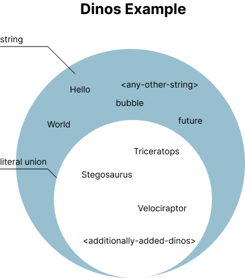

@page learn-typescript/types Types
@parent learn-typescript 4

@description Learn how to declare types in TypeScript.

@body

## Overview

In this part, we will:

- Discover how to declare the various types used in TypeScript
- Discuss how types can be inferred
- Show how to assert types

The exercises will teach you how to:

- Spot and correct basic type mistakes
- Create a typed variable

## Basic Types

Types explain what you can and can’t do with a value, take for example numbers and strings. In JavaScript, on strings, you have access to `.length`, on a number you do not. Types also determine what will happen when you apply operators to values. For example, the `+` operator, what does the following do?

```javascript
console.log(a + b);
```

Some might say it adds `a` and `b` together, others that it concatenates `a` and `b`. Both are potentially right. To come to the correct answer, we need to know what `a` and `b` are. If `a` and `b` are numbers, the `+` will perform addition, if they are strings - concatenation. The difference between the two is their underlying types.

> **Note:** If you are familiar with JavaScript’s primitive types you may recognize some of the names coming up. The types `string` `boolean` and `number` should feel familiar. These types are the same in TypeScript as they are in JavaScript and are at times referred to as primitive types.

### Boolean

`boolean` is a type that can only be `true` or `false`.

```typescript
let isCarnivore: boolean = true;
let isHerbivore: boolean = false;
```

### Number

`number` is used for numbers. If you are familiar with other typed languages, like `c++` you may be familiar with specific number types like `unsigned int` and `float`. In JavaScript and TypeScript, there is only `number`.

```typescript
let teeth: number = 100;
let hex: number = 0xf00d;
```

### String

`string` is used for a collection of characters like words.

```typescript
let name: string = "Leoplurodon";
```

### Literals

In Typescript, there is a subset within string, number, and boolean which allow you to refine the specificity of the type. These are called type literals. A string literal is a single string for example:

```typescript
type StringLiteralExample = "hello";
```

If we were to assign a variable to this `StringLiteralExample` type we just declared, we would see the only value it can be is `"hello"`.

```typescript
let invalid: StringLiteralExample = "a"; // ERROR
let valid: StringLiteralExample = "hello"; // No issues
```

What we have done is restricted the string type to be only the single string `"hello"`. The same can be done with `number`s, and less helpfully, `boolean`s. Literals like this are very powerful when used in conjunction with type unions. Allowing us to expand our subset to include multiple values.

```typescript
type Dinos = "Stegosaurus" | "Triceratops" | "Velociraptor"; //|… any additional dinos
```

<div style='text-align:center'>
	
</div>

> **Note:** In TypeScript projects and applications using unions like the one above is often used as a low-overhead version of [enums](#enum).

While we spent the time going over what a literal is. For the remainder of this section (and sections to come), we will not make the distinction between type literals and types since literals are just types.

### Array

```typescript
let list: number[] = [1, 2, 3];

let raptors: Array<string> = ["Blue", "Charlie", "Delta"];
```

### Object

```typescript
let user: { name: string; age: number } = { name: "Justin", age: 36 };
```

> **Note:** Later we will learn about [learn-typescript/interfaces], which are
> a better way of describing objects because the description
> can be reused.

### Intersections

There are many different ways to create new types from existing types in TypeScript. Type intersections allow us to create a type with all the types of one type with all the types of another type. Let's imagine we have the following types.

```ts
type Person = {
  name: string;
  age: number;
};

type AnimalTrainer = {
  level: "rookie" | "intermediate" | "advanced";
  animals: Array<Animals>;
};
```

However, we also need a `DinosaurCareTaker`. A Dinosaur caretaker is a `Person` and an `AnimalTrainer`. Intersections allow us to create a type from `Person` and `DinosaurCareTaker` using the `&`symbol.

```ts
/**
 * {
 *   name: string;
 *   age: number;
 *   level: "rookie" | "intermediate" | "advanced";
 *   animals: Array<Animals>;
 * }
 */
type DinosaurCareTaker = Person & AnimalTrainer;
```

`DinosaurCareTaker` looks good but there is more to being a dinosaur caretaker than just being a `Person` and an `AnimalTrainer`. Luckily, there can be more than one intersection in a type declaration and we can add the specifics of `DinosaurCareTaker` in another intersection.

```ts
/**
 * {
 *   name: string;
 *   age: number;
 *   level: "rookie" | "intermediate" | "advanced";
 *   animals: Array<Animals>;
 *   dinosaurName: string;
 *   dinosaurType: "carnivore" | "herbivore";
 * }
 */
type DinosaurCareTaker = Person &
  PokemonTrainer & {
    dinosaurName: string;
    dinosaurType: "carnivore" | "herbivore";
  };
```

There are a couple of things to be aware of when using type intersections. One is that order doesn’t matter since the intersection operator (`&`) is associative. This means the following two types (`A` and `B`) are the same.

```ts
type A = A1 & A2;
type B = A2 & A1;
```

Another common thing to happen with intersections is to give the intersection something that is unsatisfiable. For example, creating a type from the intersection of two string unions

```ts
type Union1 = "hello" | "world";
type Union2 = "foo" | "bar";

type Intersection = Union1 & Union2;
```

…or trying to create a type from the intersection of two types that share a key name but the type of the key is different in both types

```ts
type Object1 = {
  name: string;
  age: number;
};

type Object2 = {
  description: string;
  age: string;
};

type Intersection = Object1 & Object2;
```

Both of these will appear to work, however, when used, the type of `Intersection` is never and an error reading something along the lines of

> Type 'X' is not assignable to type 'never'.ts(2322)

will appear.

### Tuple

```typescript
let sillyList: [number, string];

sillyList = [5, "boop"]; //typescript is happy

sillyList = ["boop", 5]; //will error
```

### Enum

Enums allow the aliasing of names to a list of numeric values. Like most indexing, enums start their first member at 0.

```typescript
enum Color {
  Red,
  Green,
  Blue,
}
let greenColor: Color = Color.Green;
```

Enums can have their first value manually set, or manually set all values

```typescript
enum Month {
  January = 1,
  February,
  March,
  April,
  May,
  June,
}
let feb = Month[2];

enum Month {
  January = 1,
  March = 3,
  May = 5,
}
let may = Month[5];
```

### Unknown

Unknown describes a variable where we may not know the type. Variables defined with the `unknown` type can later be narrowed to more specific types using `typeof` checks or comparisons.

Note that variables of type `unknown` have no accessible properties or functions.

```typescript
let value: unknown = 5;

value = "words";
value.length; // Will give "Object is of type unknown" error

// Will give "Type unknown is not assignable to type string" error
const value2: string = value;

// Check type using typeof
if (typeof value === "string") {
  // Can successfully narrow
  const stringValue: string = value;
  console.log("Length is", stringValue.length);
}
```

### Any

Any is useful when you want to opt-out of type checking. Using `any` will disable all compile-time checks including access to properties and functions. This is mostly useful for 3rd party data structures that you do not know the shape of, or when incrementally opting in to types.

```typescript
let my3rdPartyData: any = 5;
my3rdPartyData = "five";

my3rdPartyData.invalidFunction(3); // Will not error until runtime
```

### Void

No type at all - commonly used with functions that don't return a value.

```typescript
function buttonClick(): void {
  console.log("I clicked a button that returns nothing");
}
```

### Null & Undefined

Null and Undefined are two separate types, and subtypes of all other types, meaning they can be assigned to another type like string or number unless the <a href="https://www.typescriptlang.org/docs/handbook/compiler-options.html" target="\_blank">--strictNullChecks</a> flag is used.

### Never

The never type represents a value that will never occur.

```typescript
function error(message: string): never {
  throw new Error(message);
}
```

## Type Inference

When we don't provide explicit types for our variables, TypeScript will do its best to infer the types, and it's very good at it. The following code will not compile due to type inference.

```typescript
let name = "Sally";
let height = 6;
name = height;
//Type 'number' is not assignable to type 'string'
```

Type can also be inferred from complex objects.

```typescript
let person = {
  name: "Sally",
  height: 6,
  address: {
    number: 555,
    street: "Rodeo Drive",
  },
};
person.name = "Cecilia";
//works
person.name = 6;
//Type '6' is not assignable to type 'string'.
person.address.number = "five fifty-five";
//Type '"five fifty-five"' is not assignable to type 'number'.
```

TypeScript will infer the return value of a function as well.

```typescript
function multiplier(a: number, b: number) {
  return a * b;
}
var multiplied: number = multiplier(2, 3);
//works

var str: string;
str = multiplier(10, 20);
//Type 'number' is not assignable to type 'string'.
```

Type inference can be a very helpful tool in refactoring code and helping better document expectations for our code.

### Type assertions

Type assertions are a way to override the inferring of types. There are two different syntaxes, angle-brackets and as.

```typescript
let someValue: any = "this is a string";

let strLength: number = (<string>someValue).length;

let otherValue: any = "this is a string";

let otherLength: number = (otherValue as string).length;
```

The `as` syntax is usually preferred because the `<type>` conflicts with JSX syntax.

## Exercise: Fix Type Errors

### The Problem

In this exercise, we will learn to spot and correct basic type errors by
fixing the type errors in `2a-fix-errors.ts`:

```typescript
let isLoading: boolean;
isLoading = true;
isLoading = "false";

let inventory: Array<number> = [];

inventory.push("tacos", "hamburgers");

function greet(name: string, age: number): string {
  return `${name} is ${age} years young.`;
}

export const jessica = greet(30, "Jessica");

export const tom = greet("Tom", 42, "software");

export { isLoading, inventory };
```

### What You Need to Know

The exports of `2a-fix-errors.ts` should look like:

```typescript
it("exports are correct", function () {
  assert.equal(isLoading, false, "isLoading");

  assert.deepEqual(inventory, ["tacos", "hamburgers"], "inventory");

  assert.equal(jessica, `Jessica is 30 years young.`, "jessica");

  assert.equal(tom, `Tom is 42 years young.`, "Tom");
});
```

### Verify Your Solution

✏️ Run the following to verify your solution:

```shell
npm run 2a-types
```

### The Solution

<details>
<summary>Click to see the solution</summary>

✏️ Update `2a-fix-errors.ts` to look like:

```typescript
let isLoading: boolean;
isLoading = true;
isLoading = false;

let inventory: Array<string> = [];

inventory.push("tacos", "hamburgers");

function greet(name: string, age: number): string {
  return `${name} is ${age} years young.`;
}

export const jessica = greet("Jessica", 30);

export const tom = greet("Tom", 42);

export { isLoading, inventory };
```

</details>

## Exercise: Date It

### The Problem

In this exercise, we will create our own typed variable by updating `2b-date-export.ts` to:

- Create a `let` variable that takes a type of Date.
- Assign that variable to an instance of `Date`
- Export that variable as the default export.

### What You Need to Know

- Use `new Date()` to create an instance of Date.

### Verify Your Solution

✏️ Run the following to verify your solution:

```shell
npm run 2b-types
```

### The Solution

<details>
<summary>Click to see the solution</summary>

✏️ Update `2b-date-export.ts` to create, assign, and export a date variable.

```typescript
let me: Date;
me = new Date("6-11-1993");
export default me;
```

</details>
